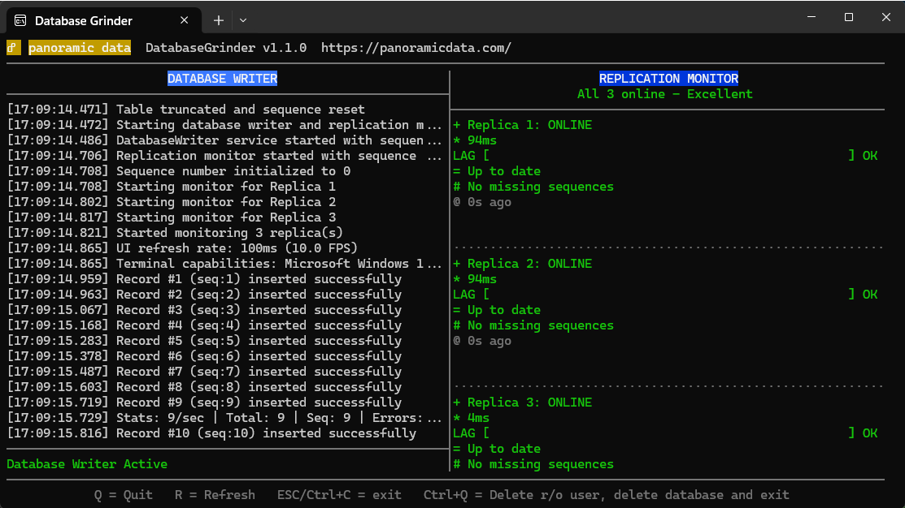

# DatabaseGrinder

A high-performance PostgreSQL replication monitoring and database stress testing tool built with .NET 10.0. DatabaseGrinder provides real-time monitoring of database write operations and PostgreSQL replication lag across multiple replica nodes with advanced sequence tracking for missing row detection.

[](Documentation/Screenshot.png)

## 🚀 Features

- **Continuous Database Writing**: Writes timestamp records every 100ms with sequence tracking to stress test database performance
- **Real-time Statistics**: Live monitoring of write operations, throughput, error rates, and sequence progression
- **Dual-Pane Console UI**: Split-screen interface showing writer status and replication monitoring with SSH optimization
- **PostgreSQL Replication Monitoring**: Track replication lag and missing records across multiple replica connections
- **Missing Row Detection**: Advanced sequence number tracking to identify gaps in replication beyond just lag
- **Automatic Database Setup**: Creates databases, users, and permissions automatically with proper security
- **Data Retention Management**: Automatic cleanup of records older than 5 minutes with table truncation on startup
- **Robust Error Handling**: Comprehensive error recovery and connection resilience with progressive backoff
- **Background Services**: Non-blocking operations with graceful shutdown and cleanup capabilities
- **Enhanced Visual Indicators**: Progress bars, status icons, and multi-metric lag display optimized for remote monitoring

## 🏗️ Architecture

```text
DatabaseGrinder/
├── DatabaseGrinder/
│   ├── Data/
│   │   ├── DatabaseContext.cs           # Entity Framework Core context with PostgreSQL support
│   │   └── Migrations/                  # EF Core migrations including sequence number support
│   ├── Services/
│   │   ├── DatabaseSetupService.cs      # Automatic DB/user provisioning with superuser management
│   │   ├── DatabaseCleanupService.cs    # Database cleanup and resource management
│   │   ├── DatabaseWriter.cs            # Continuous write operations with sequence tracking
│   │   ├── ReplicationMonitor.cs        # Multi-threaded replication lag monitoring
│   │   └── UIManager.cs                 # Console UI coordination and lifecycle management
│   ├── UI/
│   │   ├── ConsoleManager.cs            # Cross-platform console layout with differential rendering
│   │   ├── LeftPane.cs                  # Database writer display with statistics
│   │   └── RightPane.cs                 # Replication monitor with enhanced visual indicators
│   ├── Models/
│   │   └── TestRecord.cs                # Database model with ID, SequenceNumber, and Timestamp
│   ├── Configuration/
│   │   └── DatabaseGrinderSettings.cs   # Strongly-typed configuration with validation
│   └── Program.cs                       # Application entry point with DI and lifecycle management
└── Documentation/
    └── Documentation.md                 # Comprehensive technical documentation
```

## 📋 Requirements

- **.NET 10.0 SDK** or later
- **PostgreSQL 17+** server with superuser access for setup
- **Windows/Linux/macOS** (cross-platform compatible)
- **Console window** minimum 80x25 characters for optimal UI display (supports 20x20 minimum)

## ⚙️ Configuration

Configure the application via `appsettings.json`:

```json
{
  "DatabaseGrinder": {
    "PrimaryConnection": {
      "ConnectionString": "Host=localhost;Database=grinder_primary;Username=DatabaseGrinder;Password=DatabaseGrinder;Include Error Detail=true"
    },
    "ReplicaConnections": [
      {
        "Name": "Replica 1",
        "ConnectionString": "Host=replica1.example.com;Database=grinder_primary;Username=DatabaseGrinderReader;Password=readpass;Include Error Detail=true"
      },
      {
        "Name": "Replica 2", 
        "ConnectionString": "Host=replica2.example.com;Database=grinder_primary;Username=DatabaseGrinderReader;Password=readpass;Include Error Detail=true"
      },
      {
        "Name": "Replica 3",
        "ConnectionString": "Host=replica3.example.com;Database=grinder_primary;Username=DatabaseGrinderReader;Password=readpass;Include Error Detail=true"
      }
    ],
    "DatabaseManagement": {
      "AutoCreateDatabase": true,
      "AutoCreateUsers": true,
      "ReaderUsername": "DatabaseGrinderReader",
      "ReaderPassword": "readpass",
      "VerifyReaderConnection": true,
      "SetupTimeoutSeconds": 30
    },
    "Settings": {
      "WriteIntervalMs": 100,
      "DataRetentionMinutes": 5,
      "UIRefreshIntervalMs": 800,
      "MinConsoleWidth": 20,
      "MinConsoleHeight": 20,
      "ConnectionTimeoutSeconds": 30,
      "QueryTimeoutSeconds": 10
    }
  }
}
```

### Configuration Properties

| Property | Description | Default |
|----------|-------------|---------|
| `PrimaryConnection.ConnectionString` | Primary database connection for writes (requires superuser privileges) | Required |
| `ReplicaConnections[].Name` | Display name for each replica connection | Required |
| `ReplicaConnections[].ConnectionString` | Replica database connections to monitor (read-only) | Required |
| `DatabaseManagement.AutoCreateDatabase` | Automatically create database if missing | `true` |
| `DatabaseManagement.AutoCreateUsers` | Automatically create reader user if missing | `true` |
| `DatabaseManagement.ReaderUsername` | Username for read-only replica connections | `DatabaseGrinderReader` |
| `DatabaseManagement.ReaderPassword` | Password for read-only replica connections | `readpass` |
| `Settings.WriteIntervalMs` | Interval between database writes (milliseconds) | `100` |
| `Settings.DataRetentionMinutes` | How long to keep test records | `5` |
| `Settings.UIRefreshIntervalMs` | Console UI refresh rate (optimized for SSH) | `800` |

## 🚀 Quick Start

1. **Clone the repository**:

   ```bash
   git clone https://github.com/panoramicdata/DatabaseGrinder.git
   cd DatabaseGrinder
   ```

2. **Configure your database connections**:

   ```bash
   cp DatabaseGrinder/appsettings.example.json DatabaseGrinder/appsettings.json
   # Edit appsettings.json with your PostgreSQL connection details
   ```

3. **Build and run**:

   ```bash
   cd DatabaseGrinder
   dotnet build
   dotnet run
   ```

4. **Monitor the output**:
   - **Left Pane**: Shows continuous database write operations with sequence numbers and statistics
   - **Right Pane**: Displays replication lag, missing sequences, and connection status for configured replicas
   - Press **Ctrl+C** to quit gracefully
   - Press **Ctrl+Q** for database cleanup and quit (removes database and read-only user)

## 📊 Console Interface

```text
                     DATABASE WRITER                         |           REPLICATION MONITOR
──────────────────────────────────────────────────────────── | ────────────────────────────────────────
[13:35:42.236] Record #302 (seq:302) inserted successfully   | ┌─────────────────────────────┐
[13:35:42.345] Record #303 (seq:303) inserted successfully   | │     REPLICATION MONITOR     │
[13:35:42.454] Record #304 (seq:304) inserted successfully   | │   2 of 3 online - 3 missing │
[13:35:42.561] Record #305 (seq:305) inserted successfully   | ├─────────────────────────────┤
Stats: 10/sec | Total: 305 | Seq: 305 | Errors: 0            | │ 🟢 Replica 1: ONLINE       │
Up: 00:00:33                                                 | │ ⚡ 150ms                     │
                                                             | │ LAG [███████·····] OK       │
Status: Database Writer Active                               | │ Behind: 2 records, 0 seq    │
Press Ctrl+C to quit | Ctrl+Q to cleanup and quit            | │ 🔢 No missing sequences     │
                                                             | │ 🕐 2s ago                   │
                                                             | ├·····························┤
                                                             | │ 🟡 Replica 2: OFFLINE      │
                                                             | │ ✖ Connection timeout        │
                                                             | │                             │
                                                             | │ 🕐 30s ago                  │
                                                             | ├·····························┤
                                                             | │ 🟢 Replica 3: ONLINE       │
                                                             | │ ⏱️ 3.2s                     │
                                                             | │ LAG [▓▓▓▓▓▓▓▓▓···] WARN     │
                                                             | │ Behind: 24 records, 3 seq   │
                                                             | │ 🔢 Missing: 301,303,305     │
                                                             | │ 🕐 1s ago                   │
                                                             | └─────────────────────────────┘
```

## 🔧 Development

### Building from Source

```bash
# Restore dependencies
dotnet restore

# Build the solution
dotnet build --configuration Release

# Run with development settings
dotnet run --project DatabaseGrinder

# Create release package
dotnet publish --configuration Release --output ./publish
```

### Project Structure

- **Entity Framework Core**: Database operations with PostgreSQL provider and automated migrations
- **Background Services**: `IHostedService` implementations for continuous operations with graceful shutdown
- **Console UI Framework**: Custom dual-pane layout with differential rendering for SSH optimization
- **Configuration System**: Strongly-typed settings with comprehensive validation
- **Dependency Injection**: Full DI container setup with scoped service lifetime management
- **Sequence Tracking**: Application-level sequence numbers for missing row detection in replication

## 📈 Performance Characteristics

- **Write Throughput**: ~10 records/second (configurable via `WriteIntervalMs`)
- **Sequence Tracking**: Continuous sequence number generation with thread-safe atomic operations
- **Memory Usage**: Minimal footprint with automatic data cleanup and efficient console rendering
- **CPU Usage**: Low impact background processing with optimized database queries
- **Database Impact**: Lightweight records (ID + SequenceNumber + Timestamp) with 5-minute automatic cleanup
- **UI Responsiveness**: SSH-optimized differential rendering at 800ms refresh rate
- **Missing Row Detection**: Real-time sequence gap analysis limited to recent records for performance

## 🔐 Security Features

- **Separate Database Users**: Distinct read/write users with minimal required permissions
- **Automatic User Provisioning**: Secure password policies with configurable credentials
- **Connection String Validation**: Input sanitization and connection parameter verification
- **Database Isolation**: Dedicated database with controlled access and automatic cleanup
- **No Sensitive Data**: Test records contain only timestamps and sequence numbers
- **Superuser Safety**: Main database user preserved during cleanup operations

## 🚨 Advanced Monitoring Features

### **Lag Classification System**
- **OK** (< 500ms): Excellent replication performance (Green progress bars)
- **GOOD** (500ms - 2s): Normal replication lag (Yellow progress bars)
- **WARN** (2s - 10s): Concerning lag levels (Red progress bars)
- **CRIT** (> 10s): Critical replication issues (Magenta progress bars)

### **Missing Row Detection**
- **Sequence Gaps**: Identifies missing records in replica databases
- **Visual Indicators**: Shows sample missing sequence numbers with counts
- **Performance Optimized**: Checks only recent sequences to avoid database overhead
- **Real-time Alerts**: Immediate notification of replication data loss

### **Enhanced Visual Indicators**
- **Status Icons**: 🟢 (Online), 🟡 (Offline), 🔴 (Error), ⚪ (Unknown)
- **Progress Bars**: ASCII bars showing lag severity with color coding
- **Multi-Metric Display**: Time lag, record count lag, and sequence gaps
- **Connection Health**: Real-time status with last-check timestamps

## 🐛 Troubleshooting

### Common Issues

1. **Database Connection Failed**:
   - Verify PostgreSQL server is running and accessible
   - Check connection strings in `appsettings.json`
   - Ensure primary user has superuser privileges for database/user creation
   - Verify firewall and network connectivity

2. **Permission Denied**:
   - Verify primary connection user has `SUPERUSER` privileges
   - Check PostgreSQL `pg_hba.conf` authentication settings
   - Ensure database creation permissions are available

3. **UI Display Issues**:
   - Ensure console window supports UTF-8 encoding
   - Minimum console size is 20x20 characters (80x25 recommended)
   - For SSH connections, verify terminal supports ANSI color codes

4. **Replication Monitoring Issues**:
   - Verify replica connections have read access to the target database
   - Check that external replication system is functioning
   - Ensure reader user exists and has SELECT permissions

### Database Cleanup

Use **Ctrl+Q** to perform complete cleanup:
- Stops all background services gracefully
- Removes the read-only user (`DatabaseGrinderReader`)
- Drops the test database (`grinder_primary`)
- Preserves the main database user for safety

### Logging and Diagnostics

DatabaseGrinder provides comprehensive logging for:
- Database connection health and performance metrics
- Replication lag calculations and sequence gap detection  
- UI rendering events and console state changes
- Error conditions with detailed context and recovery actions

## 📄 License

This project is licensed under the MIT License - see the [LICENSE](LICENSE) file for details.

## 🤝 Contributing

1. Fork the repository
2. Create a feature branch (`git checkout -b feature/amazing-feature`)
3. Commit your changes (`git commit -m 'Add amazing feature'`)
4. Push to the branch (`git push origin feature/amazing-feature`)
5. Open a Pull Request

### Development Guidelines

- Follow .NET coding conventions and use nullable reference types
- Add comprehensive XML documentation for public APIs
- Include appropriate error handling and logging
- Write unit tests for new functionality
- Ensure cross-platform compatibility (Windows/Linux/macOS)

## 📞 Support

For support and questions:

- Create an issue in this repository with detailed reproduction steps
- Review the technical documentation in `Documentation/Documentation.md`

## 🏷️ Version History

- **v1.0.0** - Initial release with core database writing and replication monitoring
- **v1.1.0** - Added enhanced visual indicators and missing row detection with sequence tracking
- **v1.2.0** - SSH optimization, differential rendering, and database cleanup functionality
- **v1.3.0** - .NET 10.0 upgrade, improved error handling, and production-ready features

---

Built with ❤️ by the Panoramic Data team using .NET 10.0 and PostgreSQL 17+